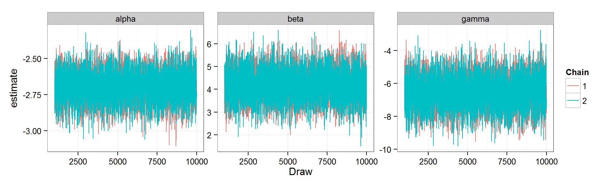
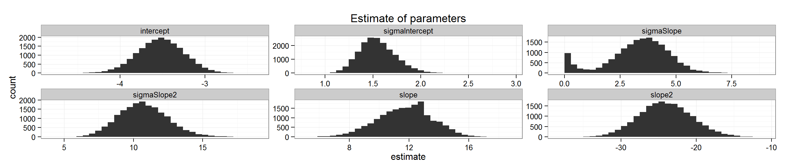

Abstract:

Insights from comparing phylogenetic and trait community spacing has led to a renewed focus on whether interspecific competition shape species occurrence. Combining theories of niche conservatism and limiting similarity, species should co-occur more with closely related species up to a threshold of niche overlap, followed by a decrease in co-occurrence. To test this prediction, we first simulate assemblages with known assembly rules to validate our predicted pattern of probability of co-occurrence and phylogenetic relatedness. We then develop a hierarchical Bayesian approach to assess probability of co-occurrence as a function of distance to the closest related species in hummingbird assemblages from Northern South America. We then applied a realistic null model of co-occurrence using ensemble niche models and cost distance to create predicted assemblages based on overlapping environmental tolerances and dispersal limitation. We find that probability of co-occurrence increases with increasing relatedness, followed by a decrease in co-occurrence among very closely related species. These data match our predicted pattern based on simulations of niche conservatism and competition in shaping co-occurrence. Further, predicted assemblages based on environment and dispersal show a consistent increase with relatedness, with no decrease among closely related species. Taken together, our results suggest that both niche conservatism and competition act simultaneously to shape hummingbird assemblages. The presence of closely related species may prevent species from occupying potentially suitable habitat. Our approach provides a holistic statistical framework combining simulations, robust Bayesian inference and reasonable null models to infer the role of competition in shaping species assemblage. 

#GitHub repository

This entire analysis can be cloned from [here](https://github.com/bw4sz/Pred_Obs.git)

Github repos have 100MB file limit, all files larger then that are hosted on dropbox:

*[Elev file](https://www.dropbox.com/s/r67vzucsknrtvma/w001001.adf?dl=0)

*[Env layers](https://www.dropbox.com/sh/fhywu4l2sx64zf6/AADruumyUX57rii3TwagE1tva?dl=0)

#Read in libraries and hummingbird data


```r
#Load required libraries
library(reshape2)
require(ggplot2)
library(picante)
library(dismo)
library(ape)
library(doSNOW)
library(gdistance)
library(foreach)
library(boot)
library(maptools)
library(rasterVis)
library(knitr)
library(vegan)
library(gridExtra)
library(R2jags)
library(stringr)
library(dplyr)

opts_chunk$set(warning=FALSE,message=FALSE)
opts_chunk$set(cache=TRUE, cache.path = 'SpeciesOverlap_cache/', fig.path='figure/',fig.width=10,echo=TRUE)

#Set git path
gitpath<-"C:/Users/Ben/Documents/Pred_Obs/"
droppath<-"C:/Users/Ben/Dropbox/"

setwd(gitpath)

#Load image if desired
#load(paste(droppath,"Thesis/Pred_Realized/Assemblages/Threshold0.05/Results/PredictedRealized.RData",sep=""))
```

The analysis takes in:

* Phylogenetic Tree in newick format

* Sites matrix with long lat

* Species Assemblages corresponding to the sites matrix


```r
#Bring in Phylogenetic Data
trx<-read.tree(paste(gitpath,"InputData\\hum294.tre",sep=""))

#format tips
new<-str_extract(trx$tip.label,"(\\w+).(\\w+)")
#get duplicates
trx<-drop.tip(trx,trx$tip.label[duplicated(new)])

#name tips.
trx$tip.label<-str_extract(trx$tip.label,"(\\w+).(\\w+)")

ctrx<-cophenetic(trx)

#Bring in the assemblages, cleaned from JP
Sites<-read.csv(paste(gitpath,"InputData//Sites.csv",sep=""),row.names=1)

####bring in Clade data
clades<-read.csv(paste(gitpath,"InputData//CladeList.txt",sep=""),header=FALSE)[,-1]
colnames(clades)<-c("Clade","Genus","Species","double","English")
clades<-clades[,1:5]

#Change the syntax on clades so it matches output, replace . with space
clades$double.<-sub(" ",".",clades$double)

#Bring in spatial data for the sites
#Extract env information for each site
Sites.sp<-SpatialPointsDataFrame(Sites[,c("LongDecDeg","LatDecDeg")],Sites)

#site by species lists
siteXspp<-t(read.csv(paste(gitpath,"InputData//siteXspp.csv",sep=""),row.names=1))
```

###Source Function Script

These are helper functions to run distribution models and calculated relatedness and cost distance.


```r
source(paste(gitpath,"SpeciesOverlapSourceFunctions.R",sep=""))
source(paste(gitpath,"SDMupdated.R",sep=""))
```

#Niche Models

Run ensemble niche models using biomod2 at a desired cell size.
To make this run, you need to [download maxent](http://www.cs.princeton.edu/~schapire/maxent/) and place it in the folder you want to save the niche models: 


```r
cell_size=.1
inLocalities<-read.csv("InputData/MASTER_POINTLOCALITYarcmap_review.csv")
envfolder<-"C:\\Users\\Ben\\Dropbox\\Thesis\\Pred_Realized\\EnvLayers"
savefolder<-"C:/Users/Ben/Dropbox/Thesis/Pred_Realized/NicheModels/"
```

Run distribution models (may need to be done offline)


```r
SDM_SP(cell_size,inLocalities,envfolder,savefolder)
```

##Import predicted suitable habitat rasters


```r
#Bring in niche models from the script SDM.R, get the folder from cell size arguemnt

#Biomod Consensus ensemble niche models
niche<-list.files(paste(savefolder,cell_size,sep="/"),pattern="ensemble.gri",full.name=T,recursive=T)

#Just from the current env predictions.
niche<-niche[grep("current",niche,value=FALSE)]

#Name the list of suitability models
names(niche)<-lapply(niche,function(path){
  split.1<-strsplit(path,"/")[[1]][10]
})
```

###Merge assemblage lists with geographic distribution of niche models


```r
#Create Spatial Points object of the rownmaes
site.raster<-raster(niche[[1]])
res(site.raster)<-cell_size

#Create PA matrix for the raster
raster.localities<-rasterize(y=site.raster,SpatialPoints(Sites.sp),fun=function(x,...) length(x))

#Which cell is each site in?
cellSites<-raster::extract(raster.localities,Sites.sp,cell=T)

#Split cell
head(cellSites<-data.frame(Sites.sp,cellSites)[,-c(4,8,9,10,11,12,14)])
```

```
##   IDComm Richness          Community  Country LatDecDeg LongDecDeg cells
## 4      5        9 Vereda Cantagallos Colombia     6.810     -73.36  6300
## 5      7        7         Lepipuerto Colombia     6.465     -73.45  6787
## 6     12       14       Puerto Bello Colombia     1.137     -76.28 13225
## 7     13       16        Rio Nabueno Colombia     1.113     -76.40 13224
## 8     14       11 Alro rio Hornoyaco Colombia     1.233     -76.53 13101
## 9     15       12       Villa Iguana Colombia     1.238     -76.52 13101
```

```r
splitCellSites<-split(cellSites,factor(cellSites$cells))

#How many duplicate communities are there, ie. number of assemblages per cell

siteXspp.raster<-sapply(splitCellSites,function(x){
  if(nrow(x)== 1) out<-siteXspp[,colnames(siteXspp) %in% x$Community]
  if(nrow(x)>1 ) {
    (out<-apply(siteXspp[,colnames(siteXspp) %in% x$Community],1,sum) > 0)*1
  }
  return(out)
})

#Get the xy lat long of the cells with sites in it
cellSitesXY<-xyFromCell(raster.localities,as.numeric(colnames(siteXspp.raster)),spatial=TRUE)
rownames(cellSitesXY@coords)<-colnames(siteXspp.raster)

##Important to get a grasp on data overlap between the different sources
congruence<-melt(list(Phylo=rownames(ctrx),Assemblage=rownames(siteXspp.raster),Suitability=names(niche),Clades=clades$double.))

write.csv(table(congruence),paste(droppath,"Thesis/Pred_Realized/Assemblages//DataOverlap.csv",sep=""))

cong<-as.data.frame.array(table(congruence))

#how many are complete
completeI<-cong[names(which(apply(cong,1,sum)==4)),]
```

##View Niche models


```r
#load models to file, makes it more transferable than keeping them on disk
modr<-lapply(niche,raster,values=TRUE)

#Get the number of records per site, atleast 10 presences. 
records_site<-names(which(apply(siteXspp.raster,1,sum,na.rm=TRUE) > 10))
modlist<-modr[names(modr) %in% records_site]

#plot a few rasters
plot(stack(modlist),nc=5,maxnl=70)
```



#Cost Path Analysis

To provide a reasonable dispersal filter we compute cost distance between assemblages. Computing cost distances among locations requires construction of environmentally weighted cost surface based on change in elevation and calculation of a least-cost path between two locations.  We used the R package gDistance to calculate cost-distance (Etten 2011). Our cost distance is a function of difference in elevation. So high elevation species see low elevation areas as a barrier, and low elevation species see high elevation areas as a barrier.


```r
#Import Friction layer, this can be changed later if we want a more fine grained 
elevr<-raster(paste(droppath,"Thesis/Pred_Realized/etopo2\\w001001.adf",sep=""))

#cut it generally by the extent of the points, less waste
elev.c<-crop(elevr,extent(raster(niche[[1]]))*1.3)

#only want above sealevel....
elev.c[elev.c < 0]<-NA

#For now aggregate elev raster to reduce complexity
elev.ca<-aggregate(elev.c,2)
```

##Find shortest cost path between all sites


```r
cl<-makeCluster(14,"SOCK")
registerDoSNOW(cl)
costPath.list<-foreach(x = 1:length(cellSitesXY)) %dopar% {
  require(raster)
  require(gdistance)
  #pick the original site. 
  orig<-cellSitesXY[x,]
  
  #What elevation is the origin
  elev_origin<-extract(elev.ca,orig)[[1]]
  if(is.na(elev_origin)) elev_origin<-0
  
  #Get the difference between the origin elevation and every cell in the raster
  elev_diff<-abs(elev_origin-elev.ca)
  
  #create a the transition matrix where permeability is high where elev difference is low
  trans_diff<-transition(elev_diff,function(x) 1/mean(x),8)
  
  #Diagonal Cell Correction, diagonals are father away than adjacent cells. 
  slope <- geoCorrection(trans_diff)
  
  #Remember this cost surface is only valid for this site as the origen, ie. we want to create just this column in the cost distance matrix
  #Cost Distance
  cdist<-costDistance(slope,orig,cellSitesXY)
  #labelling is key here.
  
  return(list(cdist))}
stopCluster(cl)

#Format the cost path matrix
m.costlist<-melt(costPath.list)
CostPathMatrix<-log(dcast(m.costlist,Var1~Var2,value.var="value")[,-1])
rownames(CostPathMatrix)<-colnames(siteXspp.raster)
colnames(CostPathMatrix)<-colnames(siteXspp.raster)
write.table(CostPathMatrix,paste(gitpath,sep="/","CostMatrix.txt"))
```

Or read in from file, CostPath take awhile to run.


```r
CostPathMatrix<-read.table(paste(gitpath,sep="/","CostMatrix.txt"),row.names=1)
colnames(CostPathMatrix)<-rownames(CostPathMatrix)
```

###Example cost path distance

Cost paths take into account frictional surfaces. We might imagine that species are more prone to dispersal within their habitat type. So in the example below, the original destination in red is a cloud forest locality and the final destination in blue is a lowland locality. A euclidean distance would have the bird cross the eastern Andean cordillera, where cost path creates a more realistic shortest distance, which is to stay within low friction space (white) and when it accounts higher frictional space (orange->green) to take a more direct path. 


```r
 #pick the original site. 
  orig<-cellSitesXY[10,]

#destination
dest<-cellSitesXY[90,]
  
  #What elevation is the origin
  elev_origin<-extract(elev.ca,orig)[[1]]
  if(is.na(elev_origin)) elev_origin<-0
  
  #Get the difference between the origin elevation and every cell in the raster
  elev_diff<-abs(elev_origin-elev.ca)
  
  #create a the transition matrix where permeability is high where elev difference is low
  trans_diff<-transition(elev_diff,function(x) 1/mean(x),8)
  
  #Diagonal Cell Correction, diagonals are father away than adjacent cells. 
  slope <- geoCorrection(trans_diff)

#shortest path
l<-shortestPath(slope,orig,dest,output="SpatialLines")


plot(elev_diff,xaxt="n",yaxt="n",main="Example Least Cost Distance")
points(orig,col="red",cex=1.5,pch=20)
points(dest,col="blue",cex=1.5,pch=20)
lines(l)
```


### Create list of assemblages in observed and predicted assemblages


```r
#Create list of assemblages
sp.lists<-apply(siteXspp.raster,2,function(x){
  out<-names(x[which(x==1)])
})
```

##Dispersal limits

Assemblages in predicted suitable environments were considered unavailable for species presence if the cost distance to the nearest observed assemblage was larger than the greatest cost distance between any two observed assemblages for that species.


```r
#Get Costpath distribution for each species
costThresh<-apply(siteXspp.raster,1,function(y){
  sites<-names(y[y==1])
  #get pairwise combination of sites
  siteCombo<-expand.grid(sites,sites)
  outH<-apply(siteCombo,1,function(x){
    CostPathMatrix[x["Var1"],x["Var2"]]
  })
  #remove infinite values
  outH<-outH[is.finite(outH)]
  #return largest distance for the species, this will be the cost path threshold
  return(max(outH))})
```

# Predicted presence and absence
Ensemble niche models return a probability value of suitability for each cell in a landscape. To define predicted suitable areas, we needed to turn this probability into a statement of predicted presence/absence. Due to differences in species prevalence, taking a fixed probability cutoff across all species will bias presence towards more common species (Liu et al. 2005). We therefore thresholded the models based on the distribution of suitability values from the observed localities (Pearson et al. 2004, Gutiérrez et al. 2014)

### Distance to closest-related species for every species in every assemblage

```r
PA_phylo<-co_occur(melt(siteXspp.raster))
```

##Create predicted assemblages

The *environment* assemblages are based on the results of the niche models, where species whose suitability is above a threshold are present. The same assemblages are used for the *environment + dispersal* assemblages, but a dispersal filter is added using the cost distance.


```r
predAssemblages<-function(thresh,plots=TRUE){

  #Create output folders
  fold<-paste(droppath,paste("Thesis/Pred_Realized/Assemblages/Threshold",thresh,sep=""),sep="")

#Read in source function to draw predicted and realized assemblages and match relatedness

dir.create(fold)
dir.create(paste(fold,"Species",sep="/"))


  #Lets go get the presence data on hummingbird distributions
  Niche_locals<-read.csv(paste(gitpath,"InputData\\MASTER_POINTLOCALITYarcmap_review.csv",sep=""))
  
  #Just take the columns you want. 
  PAdat<-Niche_locals[,colnames (Niche_locals) %in% c("RECORD_ID","SPECIES","COUNTRY","LOCALITY","LATDECDEG","LONGDECDEG","Decision","SpatialCheck","MapDecision")]
  
  #clean localities, we checked them against published range records and visually inspected them
  PAdat<-PAdat[!PAdat$LONGDECDEG==-6,]
  loc_clean<-PAdat[!PAdat$MapDecision=="REJECT",]

#########################################################
#Perform Predicted v Realized Function on all Niche Models
#########################################################

all_models<-lapply(modlist,function(x){
    pred_realized(mod=x,thresh.suit=thresh,dispersal=FALSE,plots=FALSE,loc_clean=loc_clean,fold=fold)
})

if(plots){print("Species assembages: No dispersal filter")}

#combine all datasets
#This naming function would need to changed on other systems
names(all_models)<-names(modlist)

#Remove models that failed. 
working_models<-all_models[!sapply(sapply(all_models,nrow),is.null)]
failed_models<-all_models[sapply(sapply(all_models,nrow),is.null)]

#melt and name list
#remove any species that failed. 
all.species.dataND<-melt(working_models,id.vars=c("Locality","P_A","Suitability","Species","LongDecDeg","LatDecDeg"))

all_modelsDD<-lapply(modlist,function(x){
    pred_realized(mod=x,thresh.suit=thresh,dispersal=TRUE,plots=FALSE,loc_clean=loc_clean,fold=fold)
})

if(plots){print("Species assemblages including dispersal filter")}

#combine all datasets
#This naming function would need to changed on other systems
names(all_modelsDD)<-names(modlist)

#Remove models that failed. 
working_modelsD<-all_modelsDD[!sapply(sapply(all_modelsDD,nrow),is.null)]
failed_modelsD<-all_modelsDD[sapply(sapply(all_modelsDD,nrow),is.null)]

#melt and name list
#remove any species that failed. 
all.species.dataD<-melt(working_modelsD,c("Locality","P_A","Suitability","Species","LongDecDeg","LatDecDeg"))

all.species.dataND$Hyp<-"Env"
all.species.dataD$Hyp<-"Env_Dispersal"

#Merge together as a list, name the hyps and melt
all.species.data<-rbind_all(list(all.species.dataND,all.species.dataD))

#drop duplicate name column
all.species.data<-all.species.data[,!colnames(all.species.data) %in% "L1"]

#Set working directory to output folder
dir.create(paste(fold,"Results",sep="/"))
setwd(paste(fold,"Results",sep="/"))

#add in which clade each focal species is
PA_mult2<-merge(all.species.data,clades[,-c(3,4,5)],by.x="Species",by.y="double.")

#remove the "Present/Absent column" it needs to be 0,1
PA_m2<-PA_mult2[,-3]

#Name the columns
colnames(PA_m2)[c(6,7)]<-c("P_R","P_A")

#merge with phylogenetic distance
PA_m2<-merge(PA_m2,PA_phylo[,-3],by=c("Species","Locality"))

#Final data format
PA_m2<-PA_m2[!(PA_m2$Hyp=="Env_Dispersal" & PA_m2$P_R=="PA_Binary"),]

#take out values greater than 95% quartile
phylo_out<-with(PA_m2,quantile(PA_m2[,"Phylo.Relatedness"],.95,na.rm=T))

#remove outliers
PA_m2$Phylo.Relatedness[PA_m2$Phylo.Relatedness > phylo_out]<-NA 

#return data
return(PA_m2)
}
```

Sensitivity analysis shows that suitabilty threshold of 80% is a reasonable value, compute predicted and realized distributions. The function is specified as 1-threshold/100.


```r
#Plotting gives summary graphs
PA_m2<-predAssemblages(thresh=.05,plots=TRUE)   
```

```
## [1] "Species assembages: No dispersal filter"
## [1] "Species assemblages including dispersal filter"
```

Save image in case we need to start here.


```r
#load("PredictedRealized.Rdata")
save.image("PredictedRealized.Rdata")
```

##Combine simulation, predicted and observed assemblages.

Read in simulated data - see Simulations.Rmd


```r
simall<-read.csv("C:/Users/Ben/Documents/Pred_Obs/Bayesian/simdats.csv",row.names=1)

colnames(simall)<-c("Locality","Species","P_A","Phylo.Relatedness","Hyp","Iteration")

simall$P_R<-"Simulation"
```

Bind data to one dataframe.


```r
#legacy name change.
datF<-PA_m2

#make formats the same
datF$Locality<-as.numeric(as.character(datF$Locality))
datF$P_A<-as.integer(datF$P_A)

#bind with simulated data
datF<-rbind_all(list(datF,simall))

#split data into types of assemblages
#drop Env + Dispersal for observed, its just a data subset
sdat<-split(datF,list(datF$P_R,datF$Hyp),drop=TRUE)

names(sdat)<-c("Niche Cons + comp","Env","Observed","Env + Dispersal","Lottery","Niche Cons")

# remove inf values
sdat<-lapply(sdat,function(x){
  x<-x[is.finite(x$Phylo.Relatedness),]
  return(x)
})
```

How many data points in each assemblage?

```r
sapply(sdat,nrow)
```

```
## Niche Cons + comp               Env          Observed   Env + Dispersal 
##              6464             11433             11433             11433 
##           Lottery        Niche Cons 
##             19232             18928
```

#Compare to generalized linear models

While these are constrained to have the same intercept and slope for each species, they provide a reasonable check on whether the bayesian estimates are giving logical values.


```r
plotlist<-lapply(sdat,function(x){
p<-ggplot(x,aes(x=Phylo.Relatedness,y=P_A)) + geom_smooth(method="glm",family="binomial",formula=y~poly(x,2)) + theme_bw() + labs("x=Distance to closest related species in an assemblage",y="Probability of presence") + ggtitle("")
return(p)
})

#title plots
for (x in 1:length(plotlist)){
  plotlist[[x]]<-plotlist[[x]]+ggtitle(names(plotlist)[x])
}

do.call(grid.arrange,plotlist)
```



#Bayesian Analysis of Co-occurrence

## Model Formulation

$$ Y_i \sim Bern(p_i) $$

$$ logit(p_i) = \alpha_{Species[i]} + \beta_{Species[i]} *x + \gamma_{Species[i]} *x^2 $$
$$ \alpha_{Species[i]} \sim N(intercept,sigmaIntercept)$$
$$ \beta_{Species[i]} \sim N(linear,sigmaSlope)$$
$$ \gamma_{Species[i]} \sim N(polynomial,sigmaSlope2)$$

This correspondings to the winbugs models:

```r
print.noquote(readLines(paste(gitpath,"Bayesian/BPhylo.R",sep="/")))
```

```
##  [1] setwd("C:/Users/Ben/Documents/Pred_Obs/Bayesian")                                                       
##  [2]                                                                                                         
##  [3] sink("BPhylo.jags")                                                                                     
##  [4]                                                                                                         
##  [5] cat("model{                                                                                             
##  [6]   for(i in 1:length(y)){                                                                                
##  [7]       y[i] ~ dbern(p[i])                                                                                
##  [8]       logit(p[i]) <- alpha[Species[i]] + beta[Species[i]] * dist[i] + gamma[Species[i]] * pow(dist[i],2)
##  [9]     }                                                                                                   
## [10]                                                                                                         
## [11]     for (j in 1:s){                                                                                     
## [12]     beta[j] ~ dnorm(linear,tauSlope)                                                                    
## [13]     alpha[j] ~ dnorm(intercept,tauIntercept)                                                            
## [14]     gamma[j] ~ dnorm(polynomial,tauSlope2)                                                              
## [15]     }                                                                                                   
## [16]                                                                                                         
## [17]     linear ~ dnorm(0,0.001)                                                                             
## [18]     tauSlope ~ dgamma(0.001,0.001)                                                                      
## [19]                                                                                                         
## [20]     polynomial ~ dnorm(0,0.001)                                                                         
## [21]     tauSlope2 ~ dgamma(0.001,0.001)                                                                     
## [22]                                                                                                         
## [23]     intercept ~ dnorm(0,0.001)                                                                          
## [24]     tauIntercept ~ dgamma(0.001,0.001)                                                                  
## [25]                                                                                                         
## [26]     sigmaSlope <- pow(1/tauSlope,.5)                                                                    
## [27]     sigmaSlope2 <- pow(1/tauSlope2,.5)                                                                  
## [28]     sigmaIntercept<- pow(1/tauIntercept,.5)                                                             
## [29]                                                                                                         
## [30]     }",fill = TRUE)                                                                                     
## [31]                                                                                                         
## [32] sink()
```

##Define bayes model function

Define a function that takes in species, presence/absence and distance to the closest related species for each type of assemblage, and returns the posterior estimates of X and X^2.


```r
Bayes<-function(presence,distance,species,runs,burn,hier){

#needs libraries specified to run in parallel
library(ggplot2)
library(R2jags)
library(reshape2)
library(stringr)


#Full hierarchical or single slope model?
#heir= full hierarchical

if(hier){
  source(paste(gitpath,"Bayesian/BPhylo.R",sep="/"))
  
  #Intials
  InitStage <- function() {list(alpha=rep(0.1,Dat$s),beta=rep(0.1,Dat$s),gamma=rep(0.1,Dat$s),intercept=0.001,tauIntercept=0.001,linear=0.1,tauSlope=0.001,tauSlope2=0.001,polynomial=0.1)}

  #Parameters to track
  ParsStage <- c("intercept","linear","sigmaSlope","sigmaIntercept","polynomial","sigmaSlope2","alpha","beta","gamma")
  
  #name of jags model
  mf="BPhylo.jags"
}

if(!hier){
  source(paste(gitpath,"Bayesian/Single.R",sep="/"))
    #Intials
  InitStage <- function() {list(intercept=.1,linear=.1,polynomial=.1)}

  #Parameters to track
  ParsStage <- c("intercept","linear","polynomial")
  mf="Single.jags"
  }

#make species a factor
species<-as.factor(species)

#Input Data
Dat <- list(
  y=as.numeric(presence),
  dist=distance,
  Species=as.numeric(species),
  s=nlevels(species))

#MCMC options
ni <- runs  # number of draws from the posterior
nt <- 2    #thinning rate
nb <- 0  # number to discard for burn-in
nc <- 2  # number of chains


#Jags

m = jags(inits = InitStage,
         n.chains=nc,
         model.file=mf,
         working.directory=getwd(),
         data=Dat,
         parameters.to.save=ParsStage,
         n.thin=nt,
         n.iter=ni,
         n.burnin=nb,
         DIC=T)

#Remove Burnin
pars<-melt(m$BUGSoutput$sims.array)
colnames(pars)<-c("Draw","Chain","parameter","estimate")
pars<-pars[!pars$Draw %in% 1:burn,]


return(pars)}
```


##Bayes function for each assemblage type

Run 7 models in parallel.


